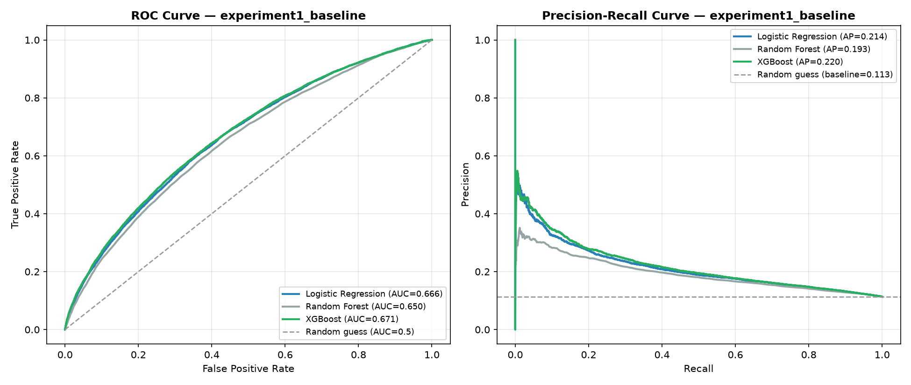
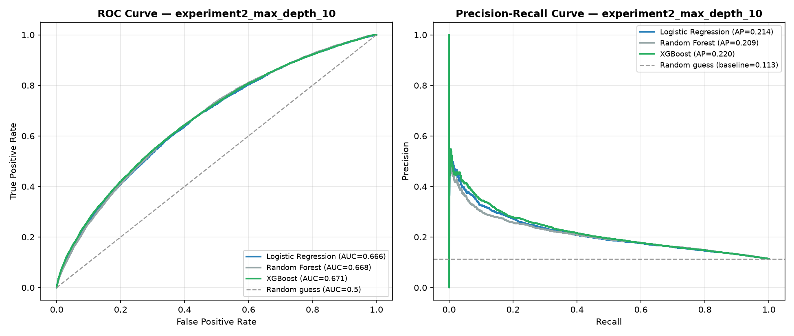
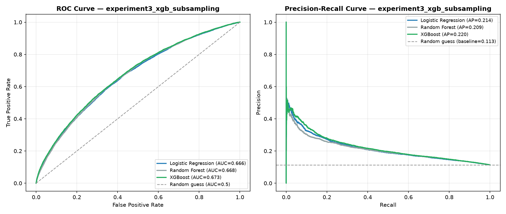
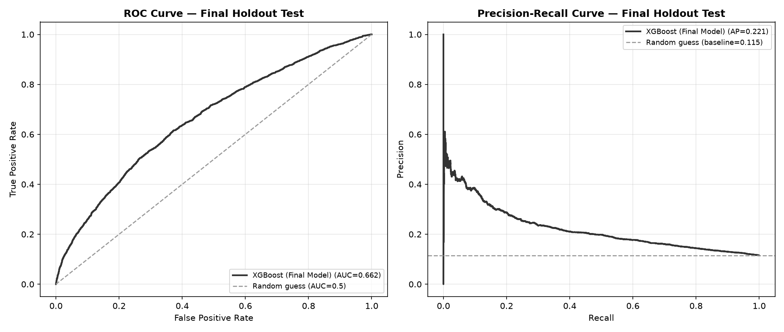

# Model Experiment Log

This file documents every model training/tuning experiment run during development —
what changed, why, and the actual resulting performance. Unlike `verification_log.md`
(which validates the data pipeline), this log tracks the model comparison story: how
Logistic Regression, Random Forest, and XGBoost performed, what design decisions were
tested, and how results changed as a result.

All results come from 5-fold `StratifiedGroupKFold` cross-validation on the 80%
development set (see `reports/verification_log.md`, Checks #7-8, for how this split
was built and verified). ROC-AUC and PR-AUC are reported as the mean across the 5
folds, with the min/max range shown to indicate fold-to-fold stability.

---

## Experiment 1: Baseline (initial hyperparameters)

**Date/context:** first full run of `run_cross_validation()`, immediately after
finalizing the feature set (`get_model_features()`, 30 predictor columns) and the
3-model comparison design.

**Model settings:**

| Model | Key settings |
|---|---|
| Logistic Regression | `max_iter=1000`, `class_weight="balanced"` |
| Random Forest | `n_estimators=300`, `class_weight="balanced"`, `random_state=42` — depth **unbounded** (default `max_depth=None`), default bagging (`bootstrap=True`, `max_features="sqrt"`) |
| XGBoost | `n_estimators=300`, `max_depth=4`, `learning_rate=0.05`, `scale_pos_weight` (computed from class ratio, ≈7.9), `eval_metric="logloss"`, `random_state=42` |

**Results (mean across 5 folds, min–max range):**

| Model | ROC-AUC | PR-AUC |
|---|---|---|
| Logistic Regression | 0.666 (0.658–0.673) | 0.214 (0.203–0.223) |
| Random Forest | 0.650 (0.644–0.657) | 0.194 (0.184–0.210) |
| XGBoost | **0.671** (0.661–0.680) | **0.221** (0.208–0.230) |

**Per-fold raw numbers:**

| Fold | LogReg ROC-AUC | LogReg PR-AUC | RF ROC-AUC | RF PR-AUC | XGB ROC-AUC | XGB PR-AUC |
|---|---|---|---|---|---|---|
| 1 | 0.671 | 0.222 | 0.649 | 0.196 | 0.670 | 0.228 |
| 2 | 0.669 | 0.216 | 0.656 | 0.194 | 0.671 | 0.222 |
| 3 | 0.658 | 0.203 | 0.644 | 0.184 | 0.661 | 0.208 |
| 4 | 0.673 | 0.223 | 0.657 | 0.210 | 0.680 | 0.230 |
| 5 | 0.660 | 0.206 | 0.646 | 0.185 | 0.672 | 0.217 |

**Interpretation:**
- XGBoost narrowly leads on both metrics; Logistic Regression is close behind despite
  being far simpler and more interpretable; Random Forest trails consistently across
  every single fold on both metrics — this is a stable pattern, not noise (fold ranges
  for RF barely overlap with the other two models).
- All three ROC-AUC scores (0.65–0.67) sit below the 0.75–0.85 range typical of strong
  clinical prediction models — expected given known project limitations (base
  population is diabetic encounters generally, not a purpose-built HRRP cohort;
  feature set excludes clinical notes/labs beyond what's in this dataset).
- All three PR-AUC scores clear the ~0.113 random-guess baseline (tied to the ~11.3%
  overall readmission rate) by roughly 2x, confirming genuine — if modest — predictive
  signal, not noise.

**Open question flagged for next experiment:** Random Forest's `max_depth` was left
at its default, unbounded value — a classic overfitting risk. Given RF is the weakest
performer here, this is the first thing worth testing with a constrained value.

**ROC and Precision-Recall curves (pooled out-of-fold predictions, all 5 folds):**



These curves are built from genuine out-of-fold predictions — every row in the 80%
development set gets exactly one prediction, always from a model version that never
saw that row during training (see `run_cross_validation()` / `plot_roc_pr_curves()`
in `train.py`). The ROC panel confirms all three models sit meaningfully above the
random-guess diagonal; the PR panel confirms all three clear the ~11.3% prevalence
baseline by roughly 2x. XGBoost's curve sits consistently above the other two across
most of both charts, though the margin over Logistic Regression is narrow.

---

## Experiment 2: Random Forest — constrain max_depth

**Date/context:** Experiment 1 showed Random Forest consistently trailing both other
models across every fold, on both metrics. `max_depth` had been left at its default,
unbounded value — a classic overfitting risk, since unconstrained trees can grow
until every leaf is pure, memorizing noise rather than learning generalizable
patterns. This experiment isolates that one variable.

**Model settings changed (only Random Forest touched — everything else identical to Experiment 1):**

```python
"Random Forest": RandomForestClassifier(
    n_estimators=300, max_depth=10, class_weight="balanced", random_state=42
)
```

**Results (mean across 5 folds, min–max range):**

| Model | ROC-AUC | PR-AUC |
|---|---|---|
| Logistic Regression | 0.666 (0.658–0.673) | 0.214 (0.203–0.223) |
| Random Forest | **0.668** (0.660–0.677) | **0.210** (0.199–0.220) |
| XGBoost | 0.671 (0.661–0.680) | 0.221 (0.208–0.230) |

**Per-fold raw numbers (Random Forest only — other two models unchanged from Experiment 1):**

| Fold | RF ROC-AUC | RF PR-AUC |
|---|---|---|
| 1 | 0.670 | 0.217 |
| 2 | 0.668 | 0.220 |
| 3 | 0.660 | 0.199 |
| 4 | 0.677 | 0.212 |
| 5 | 0.666 | 0.203 |

**Comparison to Experiment 1:**

| Metric | Exp 1 (unbounded depth) | Exp 2 (max_depth=10) | Change |
|---|---|---|---|
| RF ROC-AUC (mean) | 0.650 | 0.668 | **+0.018** |
| RF PR-AUC (mean) | 0.194 | 0.210 | **+0.016** |

**Interpretation:** constraining tree depth produced a real, meaningful improvement —
Random Forest moved from clearly the weakest of the three models to essentially tied
with Logistic Regression on both metrics, and much closer to XGBoost. This confirms
the overfitting hypothesis: unconstrained trees were fitting noise in each fold's
training data rather than learning patterns that generalize to the validation fold.
`max_depth=10` is a reasonable value to keep going forward, though further tuning
(testing depths like 6, 8, 12) could be explored later if squeezing out marginal
gains becomes a priority.

**ROC and Precision-Recall curves (pooled out-of-fold predictions, all 5 folds):**



Random Forest's curve (gray) now sits visibly closer to Logistic Regression's (blue)
and XGBoost's (green) on both panels, compared to Experiment 1's chart where it
trailed more noticeably throughout.

---

## Experiment 3: XGBoost — add stochastic subsampling

**Date/context:** with Random Forest's gap closed (Experiment 2), attention turned
to whether XGBoost — the current leader — could improve further. XGBoost's
`subsample` and `colsample_bytree` had been left at their defaults (1.0 = every tree
sees all rows and all features), an untried regularization lever conceptually
similar to what fixed Random Forest.

**Model settings changed (only XGBoost touched — everything else identical to Experiment 2):**

```python
"XGBoost": XGBClassifier(
    n_estimators=300, max_depth=4, learning_rate=0.05,
    subsample=0.8, colsample_bytree=0.8,
    scale_pos_weight=(y_train == 0).sum() / (y_train == 1).sum(),
    eval_metric="logloss", random_state=42,
)
```

**Results (mean across 5 folds, min–max range):**

| Model | ROC-AUC | PR-AUC |
|---|---|---|
| Logistic Regression | 0.666 (0.658–0.673) | 0.214 (0.203–0.223) |
| Random Forest | 0.668 (0.660–0.677) | 0.210 (0.199–0.220) |
| XGBoost | **0.673** (0.666–0.682) | **0.221** (0.209–0.232) |

**Per-fold raw numbers (XGBoost only — other two models unchanged from Experiment 2):**

| Fold | XGB ROC-AUC | XGB PR-AUC |
|---|---|---|
| 1 | 0.672 | 0.231 |
| 2 | 0.673 | 0.222 |
| 3 | 0.666 | 0.209 |
| 4 | 0.682 | 0.232 |
| 5 | 0.673 | 0.213 |

**Comparison to Experiment 2:**

| Metric | Exp 2 (no subsampling) | Exp 3 (subsample=0.8) | Change |
|---|---|---|---|
| XGB ROC-AUC (mean) | 0.671 | 0.673 | +0.002 |
| XGB PR-AUC (mean) | 0.221 | 0.221 | +0.000 |

**Interpretation:** essentially no meaningful change — well within normal
fold-to-fold noise. Unlike Random Forest (Experiment 2), which had zero depth
constraint at baseline and improved substantially once regularized, XGBoost's
baseline already included meaningful regularization (shallow `max_depth=4`, low
`learning_rate=0.05`). Adding stochastic subsampling on top of settings that were
already reasonably well-regularized left little room for further gains. This is a
legitimate, informative finding, not a failed experiment: it suggests XGBoost's
original hyperparameters were already close to a good regularization balance for
this feature set, and further tuning is likely to yield only marginal returns —
consistent with this dataset appearing to have a real predictive ceiling around
ROC-AUC 0.65–0.68 given the available features.

**ROC and Precision-Recall curves (pooled out-of-fold predictions, all 5 folds):**



---

## Final Holdout Test — XGBoost (Experiment 3 settings)

**Date/context:** with cross-validation tuning complete (Experiments 1-3), XGBoost
with Experiment 3's settings (subsample=0.8, colsample_bytree=0.8, all other
settings unchanged) was selected as the final model. This is the **first and only**
point in the entire project where the 20% holdout test set was touched — it was
carved off in Stage 1 (`GroupShuffleSplit`) and never used in any cross-validation
fold or tuning decision (see `verification_log.md`, Checks #4 and #7).

**Method:** `finalize_model.py` — trains the final model configuration on the
**entire** 80% development set (not just one fold), then evaluates it exactly once
on the untouched 20% holdout set. Model saved to `reports/final_model.joblib`.

**Result:**

| Metric | 5-fold CV (Experiment 3) | Final holdout test | Difference |
|---|---|---|---|
| ROC-AUC | 0.673 | 0.662 | −0.011 |
| PR-AUC | 0.221 | 0.221 | 0.000 |

**Interpretation:** PR-AUC matches almost exactly between cross-validation and the
true holdout set — a strong consistency signal. ROC-AUC is modestly lower on the
holdout set (a ~1 point drop), which is normal and expected: the holdout set is a
genuinely different, never-before-seen slice of patients that played no role in any
tuning decision, so *some* gap versus cross-validation performance is the norm, not
a red flag. A small, single-digit-percentage-point gap like this indicates
reasonable generalization; a large gap would have signaled overfitting to the
development set.

**This is the project's final, honest, reportable performance number:**
**ROC-AUC ≈ 0.66, PR-AUC ≈ 0.22** on a genuinely held-out test set.

**ROC and Precision-Recall curves (final holdout test set):**



---

## Template for future entries

```markdown
## Experiment N: [short description of what changed]

**Date/context:** [why this experiment was run]

**Model settings changed:** [specific parameter changes from the previous experiment]

**Results (mean across 5 folds, min–max range):**

| Model | ROC-AUC | PR-AUC |
|---|---|---|
| ... | ... | ... |

**Comparison to previous experiment:** [did it improve, worsen, or not meaningfully change?]

**Interpretation:** [what this result means, and what to try next]
```
